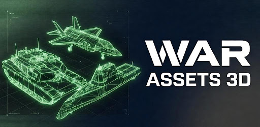
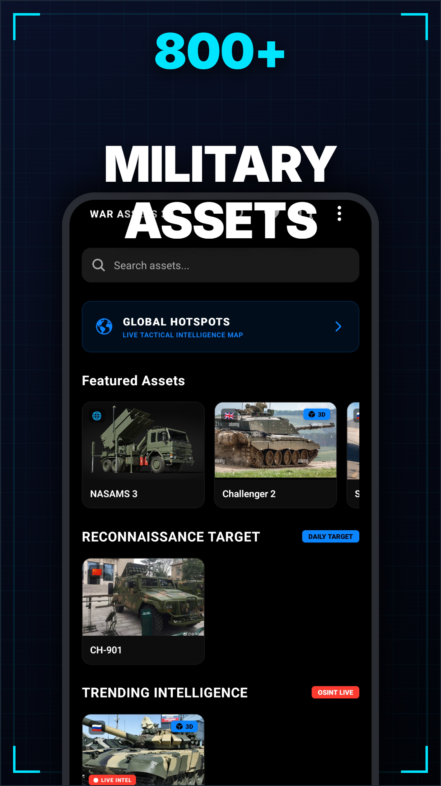
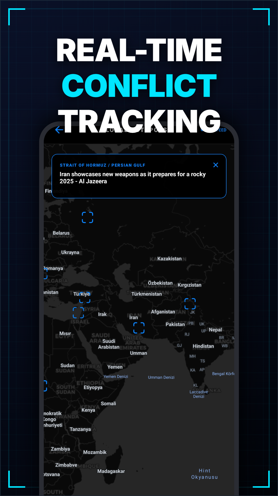
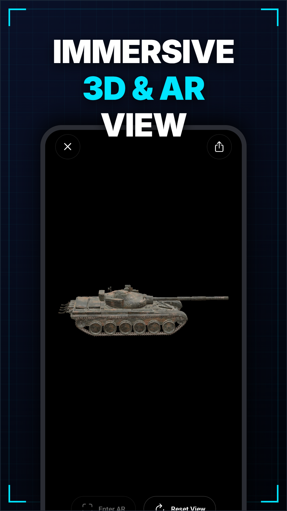
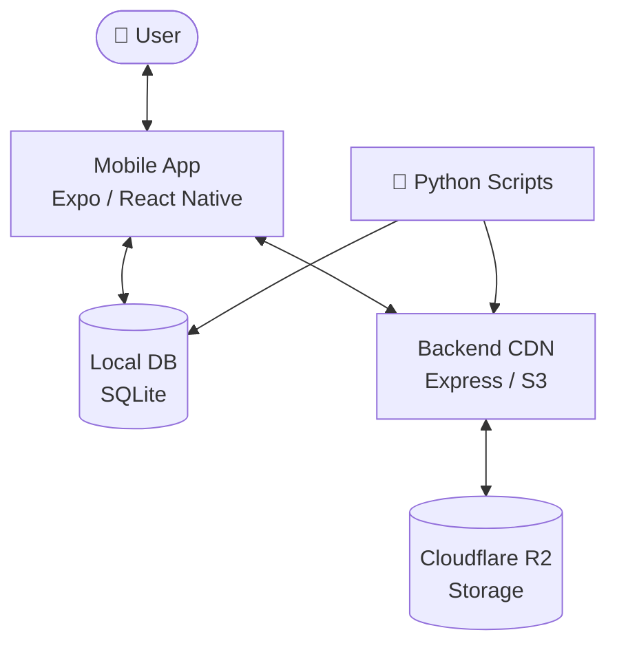

# ⚔️ War Assets 3D

<div align="center">



<br/>

[](https://play.google.com/apps/testing/com.alper.warassets)
[](https://play.google.com/apps/testing/com.alper.warassets)

<br/>

[](https://nodejs.org/)
[](https://reactnative.dev/)
[](https://expo.dev/)
[](https://threejs.org/)
[](https://www.python.org/)

<br/>

*Browse, inspect, and explore high-fidelity 3D military assets — tanks, aircraft, naval vessels and more — with detailed multilingual specifications.*

</div>

---

## 🎯 Overview

**War Assets 3D** is a mobile application for viewing and exploring high-fidelity 3D military hardware. Users can rotate, zoom, and inspect detailed models alongside technical specifications sourced from open intelligence data — covering vehicles, aircraft, naval vessels, and weapons systems from around the world.

This repository contains the full ecosystem: the mobile app, the backend CDN service, and a suite of Python data processing tools.

---

## 📲 Download & Test

> **Closed Testing is now live on Google Play.**
> Join the program to get early access and help shape the app before public release.

<div align="center">

[](https://play.google.com/apps/testing/com.alper.warassets)

</div>

---

## 📸 Screenshots

<div align="center">

| Home | Asset Detail | 3D Viewer |
|:---:|:---:|:---:|
|  |  |  

</div>

---

## 🏗️ Architecture



---

## 📂 Repository Structure

| Directory | Description | Stack |
| :--- | :--- | :--- |
| [`/mobile`](/mobile) | Main mobile app for 3D visualization | React Native, Expo, Three.js, Zustand |
| [`/backend-cdn`](/backend-cdn) | Asset delivery service for images and models | Node.js, Express, AWS-SDK (R2) |
| [`/scripts`](/scripts) | Data scrapers, OSINT tools, and model converters | Python, Boto3 |

---

## 🚀 Getting Started

### Prerequisites

- **Node.js** v18+
- **Python** v3.9+
- **Expo CLI** — `npm install -g expo-cli`
- A Cloudflare R2 bucket (or compatible S3 storage)

### Environment Setup

Create a `.env` file in the project root:

```env
SKETCHFAB_TOKEN=your_token
R2_BUCKET_NAME=your_bucket
R2_ACCOUNT_ID=your_id
R2_ACCESS_KEY_ID=your_key
R2_SECRET_ACCESS_KEY=your_secret
```

### Run Locally

```bash
# 1. Start the backend CDN
cd backend-cdn
npm install
npm start

# 2. Launch the mobile app
cd mobile
npm install
npx expo start
```

---

## 🛠️ Data Processing Suite

The scripts/ directory contains Python tooling for maintaining and enriching the asset database:

| Script | Purpose |
| :--- | :--- |
| [intelligent_fetcher.py](scripts/intelligent_fetcher.py) | Automates asset discovery and R2 synchronization |
| [metadata_refiner.py](scripts/metadata_refiner.py) | Async Wikipedia + Groq LLM pipeline for enriching asset specs |
| [converter.py](scripts/converter.py) | Handles model format conversions for optimized mobile rendering |
| [populate_osint.py](scripts/populate_osint.py) | Scrapes technical specifications and threat assessment data |

---

## 🌍 Asset Coverage

The database currently includes **757+ military assets** with multilingual specifications (🇹🇷 TR · 🇷🇺 RU · 🇸🇦 AR · 🇨🇳 ZH) across the following categories:

- 🪖 Ground Vehicles — MBTs, IFVs, APCs, Artillery
- ✈️ Aircraft — Fighters, Bombers, Helicopters, UAVs
- ⚓ Naval — Destroyers, Submarines, Carriers, Frigates
- 🔫 Weapons Systems — Missiles, Small Arms, MANPADS

---

## 📜 License

This project is licensed under the **ISC License**.

---

<div align="center">

Built for military history enthusiasts and 3D visualization fans.

</div>