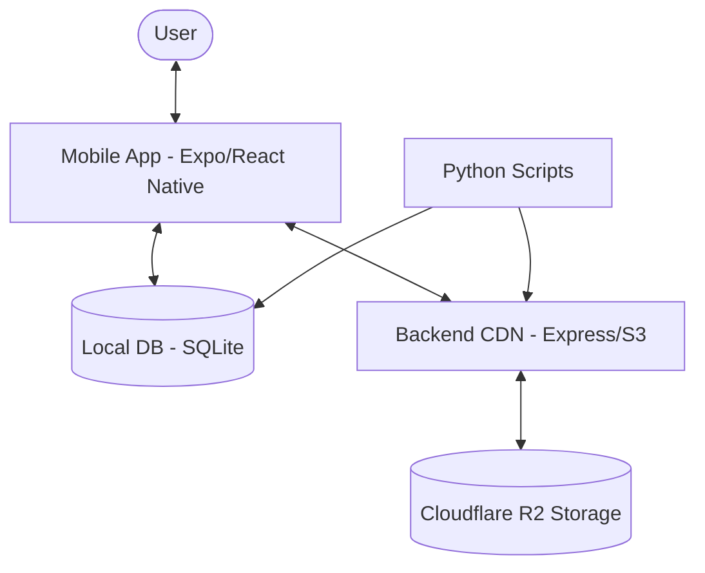

# 🛡️ War Assets 3D


[](https://nodejs.org/)
[](https://reactnative.dev/)
[](https://expo.dev/)
[](https://threejs.org/)
[](https://www.python.org/)

**War Assets 3D** is a comprehensive ecosystem for viewing, managing, and exploring high-fidelity 3D military assets. This repository contains the mobile application, the backend CDN service, and a suite of Python-based data processing tools.

---

## 🏗️ Project Architecture



---

## 📂 Repository Structure

| Directory | Description | Technology Stack |
| :--- | :--- | :--- |
| [`/mobile`](file:///d:/Software/Expo/War-Assets-3D-main/mobile) | The main mobile app for 3D visualization. | React Native, Expo, Three.js, Zustand |
| [`/backend-cdn`](file:///d:/Software/Expo/War-Assets-3D-main/backend-cdn) | Asset delivery service for images and models. | Node.js, Express, AWS-SDK (R2) |
| [Root Scripts](file:///d:/Software/Expo/War-Assets-3D-main/) | Data scrapers and model converters. | Python, Boto3, OSINT Scrapers |

---

## 🚀 Getting Started

### 1. Prerequisites
- **Node.js** (v18+)
- **Python** (v3.9+)
- **Expo CLI** (`npm install -g expo-cli`)

### 2. Environment Setup
Create a `.env` file in the root with the following variables:
```env
SKETCHFAB_TOKEN=your_token
R2_BUCKET_NAME=your_bucket
R2_ACCOUNT_ID=your_id
R2_ACCESS_KEY_ID=your_key
R2_SECRET_ACCESS_KEY=your_secret
```

### 3. Quick Run
1. **Initialize Backend:**
   ```bash
   cd backend-cdn && npm install && npm start
   ```
2. **Launch Mobile App:**
   ```bash
   cd mobile && npm install && npx expo start
   ```

---

## 🛠️ Data Processing Suite (Python)

The root folder contains several scripts to maintain the asset database:
- `intelligent_fetcher.py`: Automates asset discovery and R2 synchronization.
- `converter.py`: Handles model format conversions for optimized mobile rendering.
- `populate_osint.py`: Scrapes technical specifications and threat data.

---

## 📜 License
This project is licensed under the **ISC License**.

---

<p align="center">
  Developed with ❤️ for the 3D Visualization Community.
</p>
